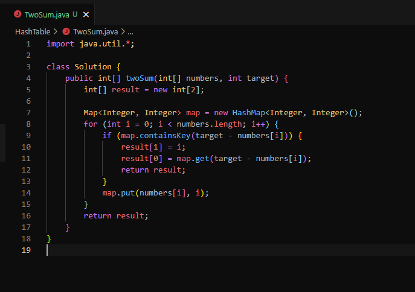
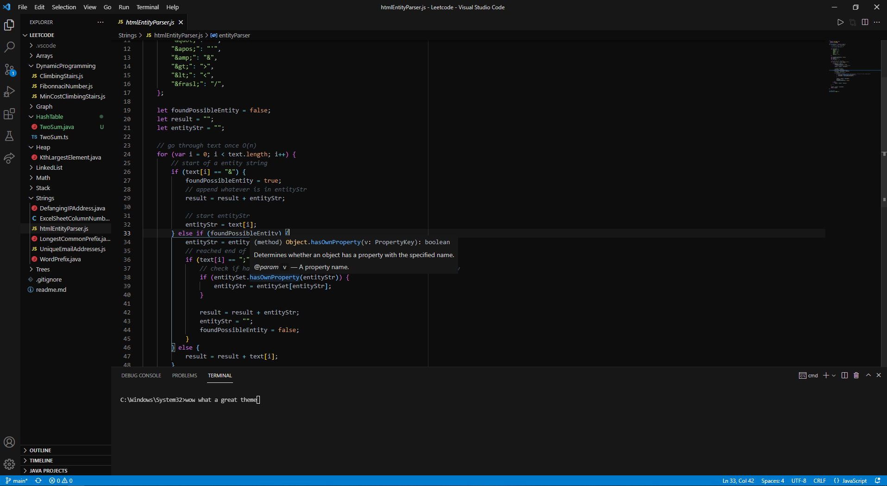

# Darker VSCode Theme

A Darker VSCode Theme

<!-- picture here -->





## Installing

Install from [VSCode Marketplace](https://marketplace.visualstudio.com/items?itemName=sajantoor.darker-theme)

## Getting Started

-   Clone or fork this repository

```
git clone
```

-   Open project in VSCode
-   Press `F5` to open a new window with your extension loaded.
-   Open `File > Preferences > Color Themes` and pick your color theme.
-   Open a file that has a language associated. The languages' configured grammar will tokenize the text and assign 'scopes' to the tokens. To examine these scopes, invoke the `Developer: Inspect Editor Tokens and Scopes` command from the Command Palette (`Ctrl+Shift+P` or `Cmd+Shift+P` on Mac) .

## Acknowledgments

-   Inspired by JetBrains Fleet

-   [VSCode Theme Editor](https://themes.vscode.one/)

-   [Atom One Dark Syntax Highlighting](https://marketplace.visualstudio.com/items?itemName=akamud.vscode-theme-onedark)
